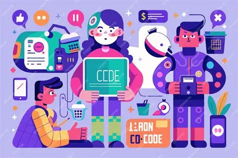

---
layout: essay
type: essay
title: Timing and Me
# All dates must be YYYY-MM-DD format!
date: 2025-12-14
published: True
labels:
  - Effort Estimation
  - Reflection
---

## Estimates? Really Off
While working on this final project, I’ve come to a startlying realization. Estimating the amount of time that is required to complete something is not something that I am partically good at. It might half be because of my inexperience but it also might half be me not having very good time management skills. I had the habit of thinking that something would take way longer than expected but in reality take only half the time required. This was a very prevalant thing as I worked throughout the project, especially in anything that related to the functionality. Most tasks felt like a chore and as a result, we often gave a estimate and way more time than was required. We often saw the problem as a whole instead of breaking it down into parts and that is probably what led to the time estimates to be so off.

## Unexpected Benefits
Even though our time estimates were wildly off, it did give us the opportunity to work on it early since we assumed that we needed to take way more time than was required. Estimating in advance made sure we always allocated more than enough time to work on the task but inversely, it also meant that time management was really inefficient since we gave so much extra time. Tracking effort was useful since it allowed us to see what the actual time it might've taken was and it slowly gave us a more accurate estimate of future tasks though that was still rare since we still gave a little more than needed time. We didn't really have a way to track our actual efforts in the group aside from the basic github. Thankfully our group was really responsible and everyone was just on it. Some of us might've been a little late but we got what we needed done and that was great. The accuracy of the tracking definetely left much to be desired though. I think the big thing we would change next time about how we estimate or track progress would be to break up the tasks into smaller ones ahead of time so we would get a more accurate estimate, we did do this somewhat near the end of the project and the times were a little closer as a result.

## It's a bird! It's a plane! It's AI
Although we did not use AI to track effort, we definetely used it various points throughout the project. AI was like superman whenever I personally encountered a error while it might have always offered a solution, it definetely offered a idea to start on possible solutions. I think working on something like this final project that is bigger on scale with actual other people participating let me more intuitively understand how to use AI as a tool instead of just as a solution. Especially on bigger scales than just individual coding, AI becomes way less reliable as a cure all, be all. But it was immensely helpful as a tool and that is something that I was grateful for throughout the course of this project.
