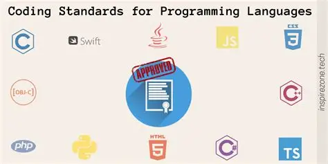

## "Real" Coding
When most people hear about coding standards, they often imagine rigid accurate comments and strict uses of classes and functions. However, while these are true to an extent, I have learned and begun to see it as a fundamental to skill to gettinga job in today's professional space. Having a standard means having something that everyone shares and is something that can connect to others. The machine we use to code on doesn't care if we have consistent naming conventions or whether or not we write a document listiing what every function does. However, the peers, other people, and our future selves does put great importance on it. I have only had a glimpse of coding standards but I have already seen the flashes of the professional practices of the industry. 

## The ESLlint Experience
After my first week of using ESLint with VSCode, I felt two conflicting emotions, frustration and understanding. At first, even getting ESLint to run and navigating the file management and path to VSCode was a bother for sure. The red squiggles also felt like an annoyance with the use of single quotes over double quotes and requiring a new line space after every line. Some of these rules felt petty and clearing them felt like a chore. Yet, I have started to see why it is necessary. Having these strict standards applied and ingrained let me see a glimpse into the professional world where everything is a little more rigid and organized so that everyone is on the same page. While I do still feel frustration with working with something new and having to format everything when I just want to "code", I am starting to understand.

## My Personal Perspective
While coding standards felt like a chore at first, I understand the necessity of it. They may not feel good to apply at first but they create a baseline of clarity for others and even for myself. It has shown me that standards are not just about clean code but also formatting and consistency so that everyone can be on the same page.

