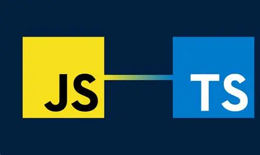

## Learning Typescript

So far, this was my first ever experience with typescript and it has been pretty okay. I am used to learning languages like Python and JavaScript, and I always felt that learning a new language was like reviewing. The basic concepts and fundamentals still transferred between languages with the only difference being that some of the "rules" are changed like in how certain things are structured. But in general felt like reviewing something that was already learned with some new properties thrown in.

## Software Engineering Perspective
From what I have learned from doing the basics of Typescript, it feels like a pretty solid language for software engineering. Since it builds off Javascript, I can see how it makes bigger projects easier to organize and to keep things like classes and objects more consistent. It building off Javascript also helps the language since it has all the advantages that Javascript has in the perspective of Software Engineering while also maintaining the more nuances features that Typescript offers like the explicit/implicit data values thats maybe a little more focused depending on the type of software that is being worked on.

## Practice WODS

## 
